# 🧞 Career Genie — AI-Powered Career Platform

<div align="center">

[](https://python.org)
[](https://streamlit.io)
[](https://groq.com)
[](https://postgresql.org)
[](LICENSE)

**A full-stack AI career platform connecting job seekers with providers — featuring resume parsing, smart job matching, skill gap analysis, 5-level progressive AI interviews, and real-time messaging.**

[Features](#-features) • [Screenshots](#-screenshots) • [Tech Stack](#-tech-stack) • [Setup](#-quick-start) • [Architecture](#-architecture)

</div>

---

## 🎯 What is Career Genie?

Career Genie is a dual-sided AI career platform built with Streamlit and powered by Groq's LLaMA 3.3 70B model. It serves two types of users:

- **Job Seekers** — Upload resume, get AI skill extraction, match with jobs, analyze gaps, and practice interviews
- **Job Providers** — Post jobs with custom AI interview configurations, rank candidates, and message applicants

---

## ✨ Features

### 👤 For Job Seekers

| Feature | Description |
|---|---|
| 📄 **Resume Parsing** | Upload PDF or DOCX — AI extracts skills, experience, education, and job titles |
| 🎯 **Smart Job Matching** | AI scores your resume against job descriptions with match %, matched skills, and gaps |
| 📊 **Skill Gap Analysis** | Visual heatmap + bubble chart showing exactly what you're missing and why it hurts your profile |
| 🗺️ **Ordered Learning Roadmap** | Personalized step-by-step skill learning plan with sub-topics, resources, and progress tracking |
| 🎤 **5-Level AI Mock Interviews** | Progressive interview system from Foundations → Expert with behavioral, technical, debugging, coding, and system design questions |
| 📈 **Progress Dashboard** | Charts showing match score trends, before/after improvement, interview performance, and where you lack |
| 💬 **Direct Messaging** | Chat with job providers about your applications |

### 🏢 For Job Providers

| Feature | Description |
|---|---|
| 📢 **Job Posting** | Post jobs with AI-auto-extracted required skills |
| 🎤 **Interview Builder** | Configure behavioral, technical, and coding question counts, marks per type, difficulty, and passing threshold |
| 🏆 **Candidate Rankings** | AI-ranked candidate table by match score with filter by status |
| 📥 **Resume Download** | Download applicant resumes directly |
| 📊 **Analytics Dashboard** | Applications by job, status breakdown pie chart, top candidates |
| 💬 **Candidate Messaging** | Message candidates directly from their profile |

---

## 📸 Screenshots

Each screen below shows a key feature of Career Genie in action.

---

### 🏠 Landing Page
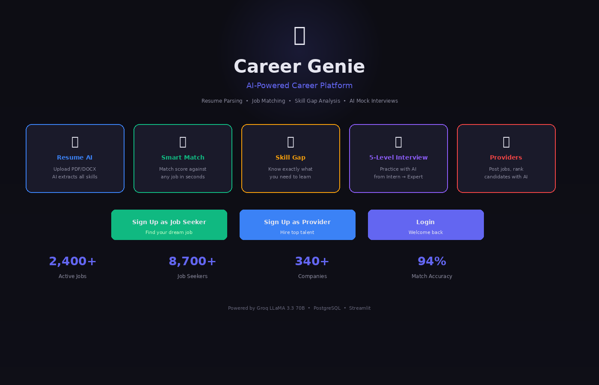
> The entry point of Career Genie. Shows the platform's 5 core features, sign-up options for both **Job Seekers** and **Providers**, and platform stats (2,400+ jobs, 94% match accuracy). Built with Streamlit's dark theme.

---

### 📊 Seeker Dashboard
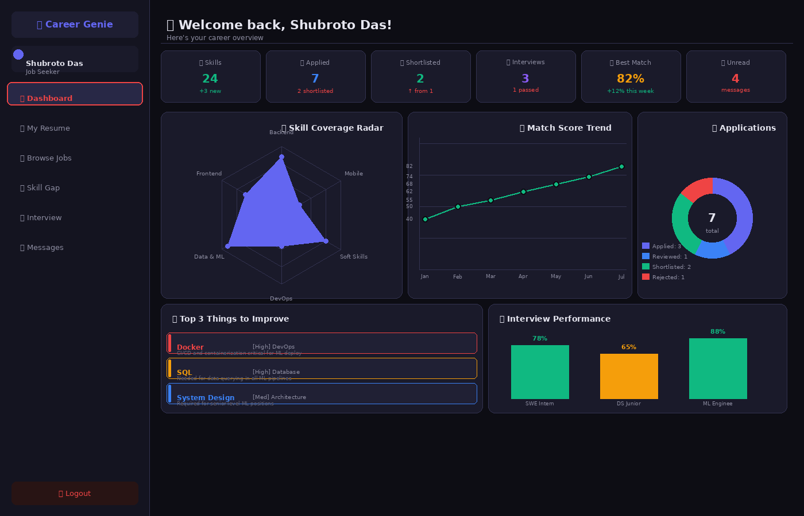
> The seeker's analytics home. Includes a **skill coverage radar chart** across 6 categories, **match score trend line** over time, **application status donut chart**, **interview performance bars**, and a "Top 3 Things to Improve Right Now" section — all backed by live PostgreSQL data.

---

### 📄 Resume Upload & AI Extraction
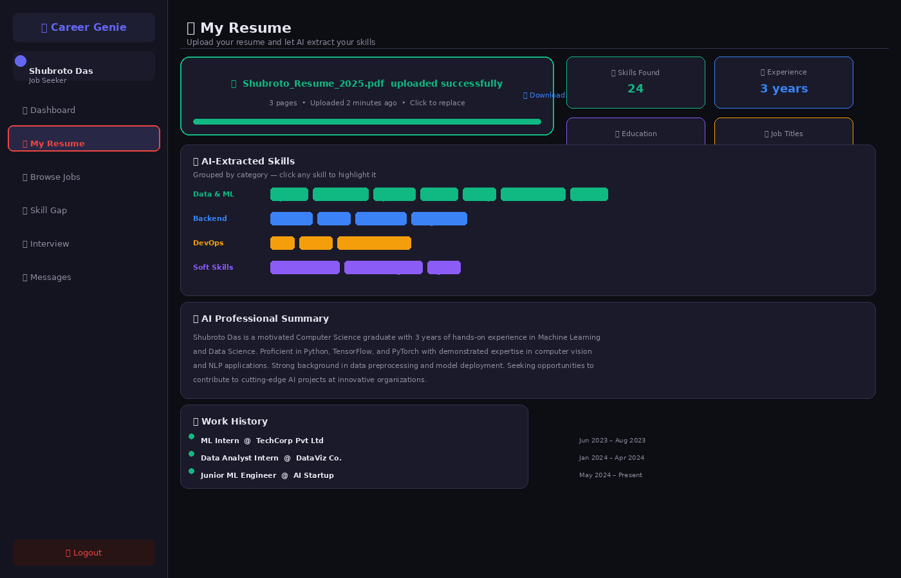
> Upload a PDF or DOCX resume and Groq LLaMA 3.3 70B automatically extracts **24 skills** grouped by category (Data & ML, Backend, DevOps, Soft Skills), detects **years of experience**, **education**, **job titles**, and generates a **professional AI summary**.

---

### 🎯 Smart Job Matching
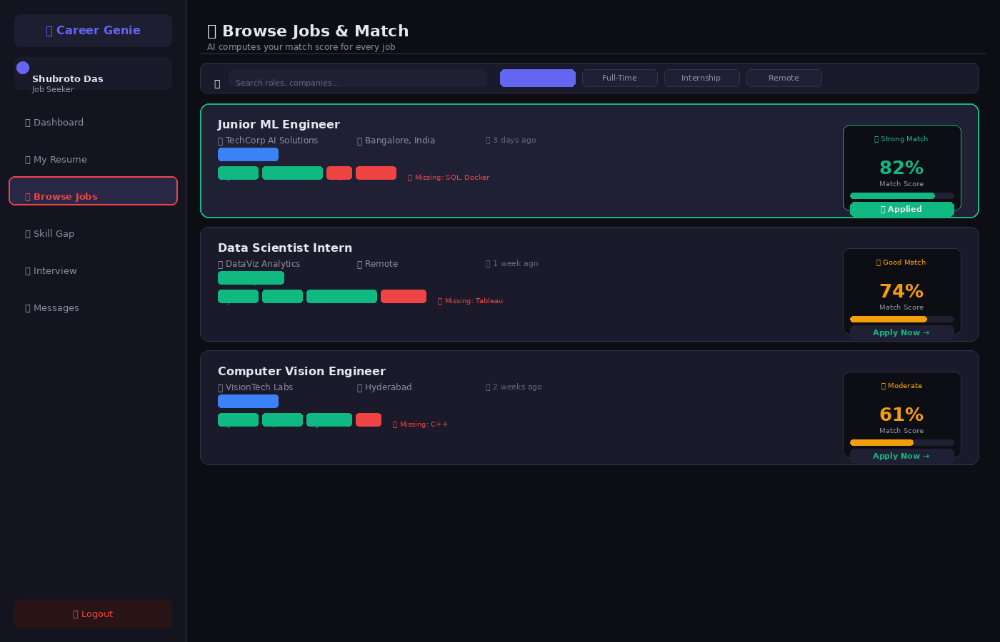
> Browse all active job postings with real-time **AI match scores** (0–100%). Each card shows matched skills in green and missing skills in red, the company, location, and a one-click **Apply** button. Filter by job type or search by role.

---

### 📊 Skill Gap Analysis
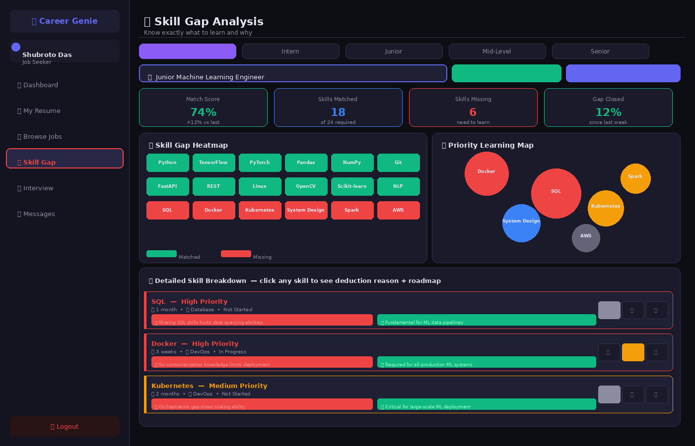
> Type any role or pick from AI-suggested roles (filtered by career level: Intern / Junior / Mid / Senior). The AI produces a **skill heatmap**, **priority bubble map**, and detailed cards for each missing skill — showing exactly **why it hurts your profile**, **why it matters**, and **how to fix it**, with 3 curated resources per skill.

---

### 🗺️ Ordered Learning Roadmap
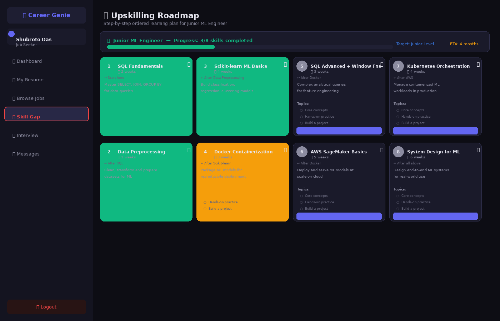
> A fully personalized upskilling plan broken into **8 sequential steps** — each with timeframe, dependency ("learn after X"), sub-topics to study in order, and a progress tracker (▶ Start → 🔄 In Progress → ✅ Done). Progress is saved to the database so it persists across sessions.

---

### 🎤 5-Level Interview Selection
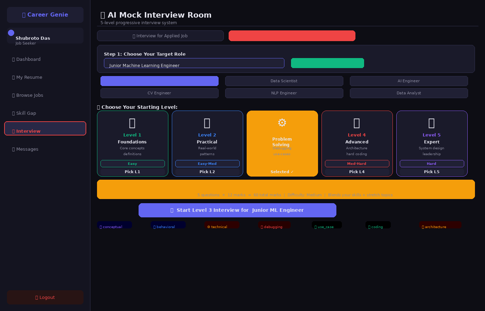
> Choose from 5 progressive difficulty levels before starting a mock interview. Each level card shows its **question types** (conceptual, behavioral, debugging 🐛, coding 💻, system design 🌐, leadership 👥), difficulty, and marks. AI suggests roles from your resume as clickable buttons.

---

### 💬 AI Interview Question (Debugging Type)
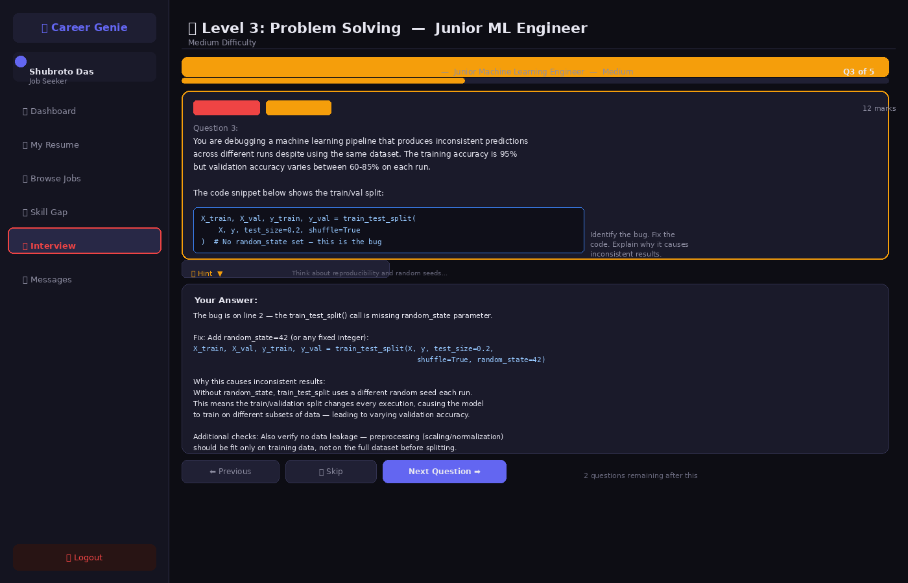
> An active Level 3 interview question of type **Debugging** — includes a real broken Python code snippet with the bug embedded. The candidate types their answer explaining the root cause, the fix, and why it happens. A hint is available on demand. 🌱 Stretch Skill badge marks questions from missing skills.

---

### 🏆 Full Interview Report
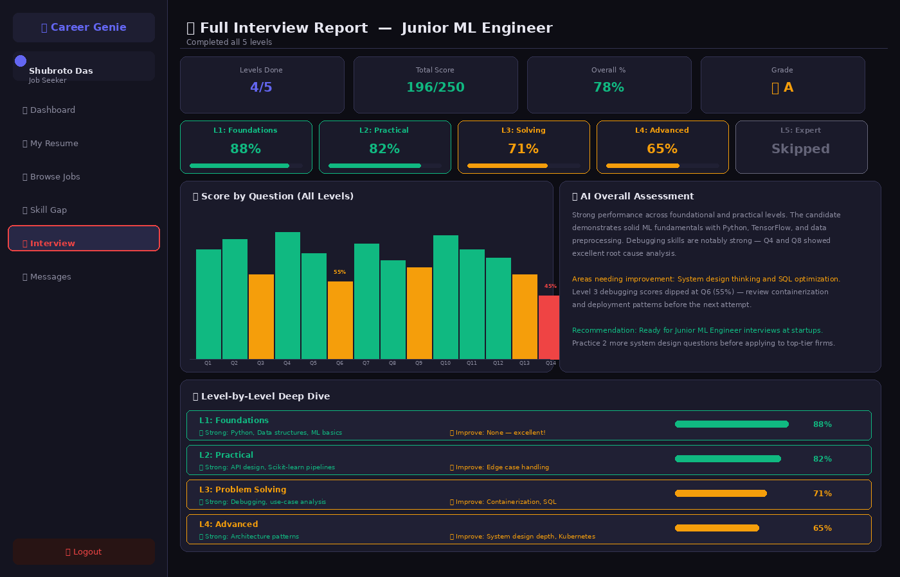
> After completing all levels, a full report shows: overall grade, score per question bar chart, **AI narrative assessment** with specific strengths and weaknesses, and a level-by-level breakdown with strong areas and what to revisit before the next attempt.

---

### 🏢 Provider Dashboard
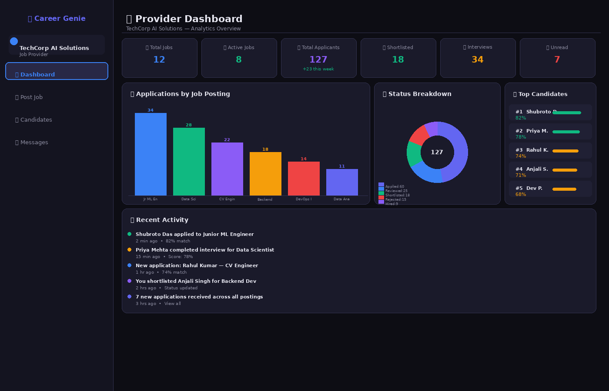
> The employer's analytics view. Shows KPIs (active jobs, total applicants, shortlisted), a **bar chart of applications per job**, **status breakdown pie chart**, **top 5 candidates by match score**, and a live **recent activity feed** showing new applications and interview completions.

---

### ⚙️ Custom Interview Builder
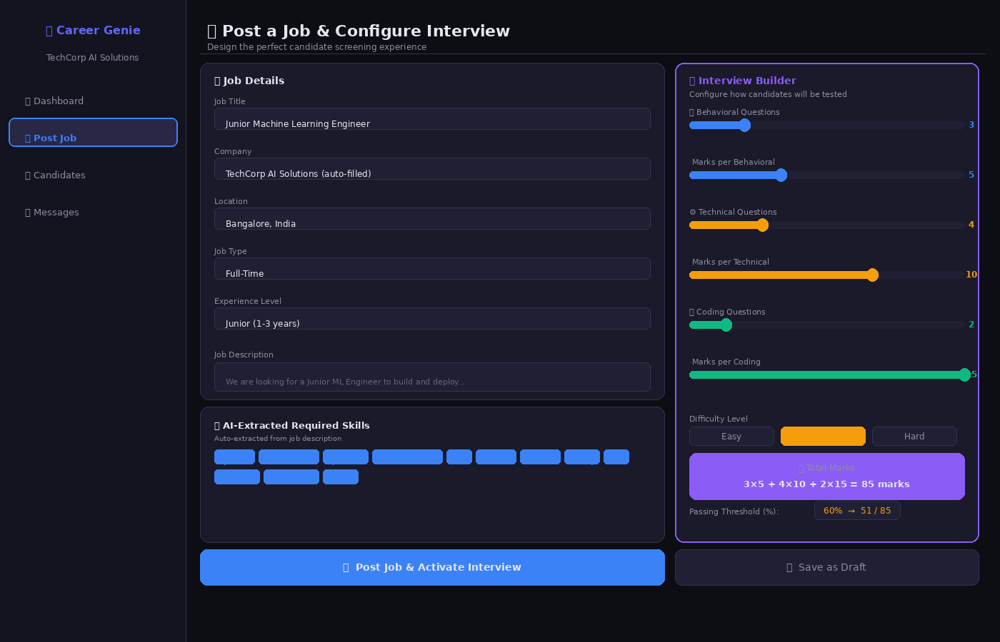
> Providers configure exactly how candidates are tested per job: set the number of **Behavioral / Technical / Coding** questions, marks per type, difficulty level (Easy / Medium / Hard), and passing threshold. The system auto-calculates total marks. Required skills are **AI-extracted from the job description** automatically.

---

### 👥 AI-Ranked Candidates
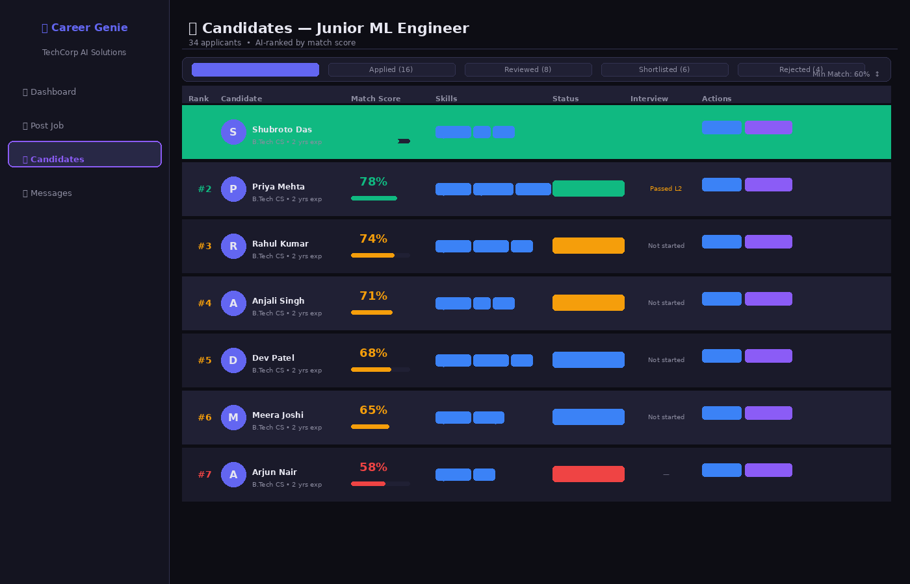
> All applicants ranked by AI match score. Each row shows the candidate's name, match % with a progress bar, top skills, current application status, and interview result. Providers can **filter by status**, **set a minimum match score**, **download resumes**, or **message candidates** directly from this page.

---

---

## 🛠️ Tech Stack

| Layer | Technology |
|---|---|
| **Frontend** | Streamlit 1.32 |
| **AI / LLM** | Groq API — LLaMA 3.3 70B Versatile |
| **Database** | PostgreSQL 16 |
| **Resume Parsing** | PyMuPDF (PDF), python-docx (DOCX) |
| **Charts** | Plotly |
| **Auth** | bcrypt password hashing |
| **Environment** | python-dotenv |

---

## 🚀 Quick Start

### Prerequisites
- Python 3.10+
- PostgreSQL installed and running
- Groq API key — [get one free at console.groq.com](https://console.groq.com)

### 1. Clone the Repository
```bash
git clone https://github.com/YOUR_USERNAME/career-genie.git
cd career-genie
```

### 2. Create Virtual Environment
```bash
python -m venv venv
# Windows
venv\Scripts\activate
# Mac/Linux/WSL
source venv/bin/activate
```

### 3. Install Dependencies
```bash
pip install -r requirements.txt
```

### 4. Set Up PostgreSQL Database
```sql
-- In psql or pgAdmin:
CREATE DATABASE career_genie;
```

### 5. Configure Environment Variables
```bash
cp .env.example .env
```

Edit `.env`:
```env
GROQ_API_KEY=your_groq_api_key_here
DB_HOST=localhost
DB_PORT=5432
DB_NAME=career_genie
DB_USER=postgres
DB_PASSWORD=your_postgres_password
```

### 6. Run the App
```bash
streamlit run app.py
```

Open **http://localhost:8501** — the app auto-creates all database tables on first run.

---

## 🗂️ Project Architecture

```
career_genie/
├── app.py                        # Main entry point + page routing
├── requirements.txt
├── .env.example                  # Environment variable template
│
├── auth/
│   ├── login.py                  # Login with bcrypt verification
│   └── signup.py                 # Signup with role selection
│
├── seeker/
│   ├── dashboard.py              # Analytics dashboard with charts
│   ├── resume_upload.py          # PDF/DOCX upload + AI parsing
│   ├── job_match.py              # Browse jobs + match score + apply
│   ├── skill_gap.py              # Gap analysis, heatmap, roadmap
│   ├── interview_room.py         # 5-level AI mock interview system
│   └── messages.py               # Chat inbox
│
├── provider/
│   ├── dashboard.py              # Analytics + top candidates
│   ├── post_job.py               # Post jobs + interview builder
│   ├── candidates.py             # View, rank, download, message
│   └── messages.py               # Chat inbox
│
└── shared/
    ├── db.py                     # PostgreSQL schema + all queries
    ├── groq_client.py            # All Groq/LLM AI functions
    ├── resume_parser.py          # Text extraction from PDF/DOCX
    └── analytics.py              # All Plotly chart builders
```

### Database Schema

```
users               — Auth, roles (seeker/provider)
seeker_profiles     — Resume text, extracted skills
provider_profiles   — Company info
job_postings        — JD, required skills, interview config
applications        — Seeker-job links with match scores
interviews          — Questions, answers, scores per application
messages            — Bi-directional chat between users
skill_gap_history   — Historical gap analyses for trend tracking
roadmap_progress    — Per-skill learning progress tracking
```

---

## 🤖 AI Features Detail

All AI is powered by **Groq's LLaMA 3.3 70B Versatile** model via structured JSON prompting.

| Function | Input | Output |
|---|---|---|
| `extract_skills_from_resume` | Resume text | Skills, experience, education, job titles |
| `compute_match_score` | Seeker skills + job skills | Score %, matched, missing, verdict |
| `analyze_skill_gap` | Skills + target role | Gap analysis with why deducted, how to fix, ordered roadmap |
| `suggest_roles_from_resume` | Skills + level filter | 12 role suggestions by career level |
| `generate_leveled_questions` | Role + skills + level 1-5 | Interview questions by type and difficulty |
| `evaluate_answer` | Question + answer | Score + feedback + strengths + improvements |
| `generate_level_feedback` | Level results | Readiness for next level, strong/weak areas |
| `get_upskilling_recommendations` | Skills + target role | Ordered roadmap + topics + certs + projects |

### 5-Level Interview System

| Level | Name | Question Types | Difficulty |
|---|---|---|---|
| 1 🌱 | Foundations | Conceptual, Behavioral, Technical | Easy |
| 2 🌿 | Practical | Technical, Scenario, Behavioral | Easy-Medium |
| 3 ⚙️ | Problem Solving | Debugging, Use Case, Coding | Medium |
| 4 🔥 | Advanced | Architecture, Hard Coding, Debugging | Medium-Hard |
| 5 💎 | Expert | System Design, Leadership, Expert Code | Hard |

---

## 🔑 Environment Variables

| Variable | Description | Example |
|---|---|---|
| `GROQ_API_KEY` | Your Groq API key | `gsk_...` |
| `DB_HOST` | PostgreSQL host | `localhost` |
| `DB_PORT` | PostgreSQL port | `5432` |
| `DB_NAME` | Database name | `career_genie` |
| `DB_USER` | Database user | `postgres` |
| `DB_PASSWORD` | Database password | `yourpassword` |

---

## 📦 Key Dependencies

```
streamlit==1.32.0        # UI framework
groq==0.9.0              # LLM API client
httpx==0.27.2            # HTTP client (pinned for groq compatibility)
psycopg2-binary==2.9.9   # PostgreSQL adapter
pymupdf==1.24.0          # PDF text extraction
python-docx==1.1.0       # DOCX text extraction
plotly==5.20.0           # Interactive charts
pandas==2.2.1            # Data manipulation
bcrypt==4.1.2            # Password hashing
python-dotenv==1.0.1     # Environment variables
```

---

## 🤝 Contributing

1. Fork the repository
2. Create a feature branch: `git checkout -b feature/amazing-feature`
3. Commit your changes: `git commit -m 'Add amazing feature'`
4. Push to the branch: `git push origin feature/amazing-feature`
5. Open a Pull Request

---

## 📄 License

This project is licensed under the MIT License — see the [LICENSE](LICENSE) file for details.

---

<div align="center">
⭐ Star this repo if you found it useful!
</div>
